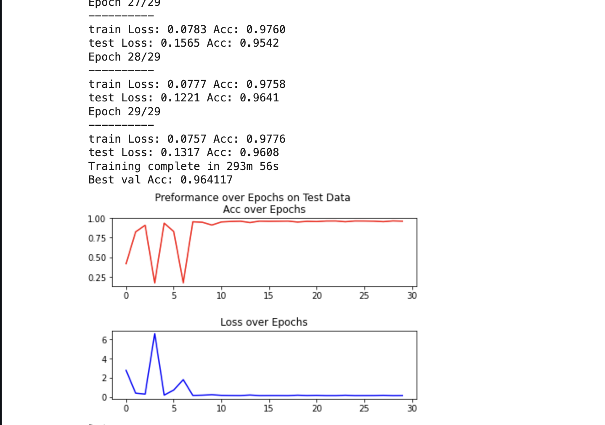

# stutternet
Using a Bi-Directional Long Short Term Memory neural network to identify and classify stutters from the LibriStutter database.

Some results are visualized below. Accuracy was SOTA at the time of writing the code. The early spikes seemed to be a result of the LR scheduler being too high initially, rather than over-fitting:

